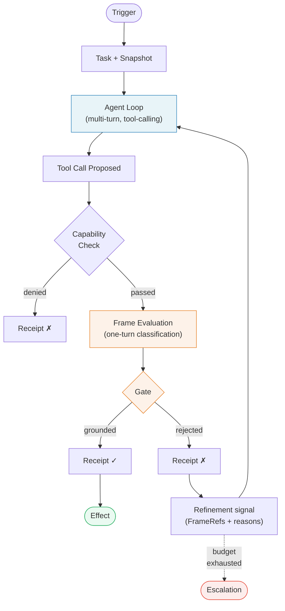
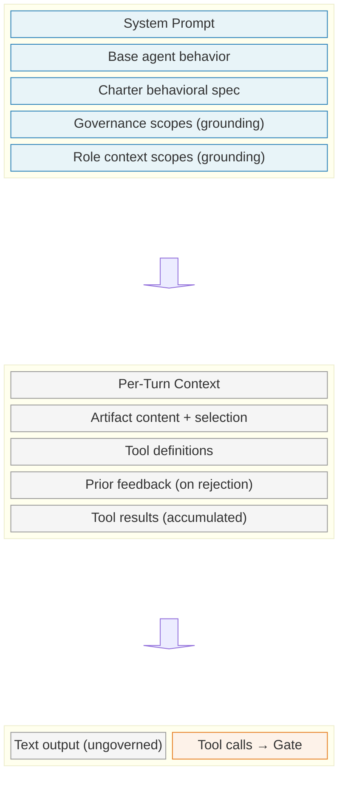
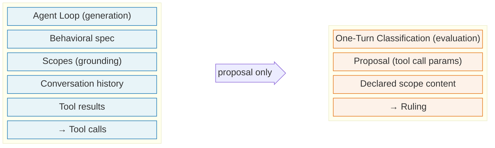

# CharteredOS

The cybernetic enclosure for intelligent agents. See `README.md` for the diagnostic frame; this document is sovereign for the mechanism.

> Only variety can destroy variety. — W. Ross Ashby, *An Introduction to Cybernetics* (1956)

---

## The Loop

The loop is the atomic unit of governed execution. Every governed action — responding to a client message, refining a contract clause, screening a research paper, reviewing a commit — is one execution of this loop.

In control-theory primitives: setpoint = Frame, plant = Actor, sensor = Evaluator, comparator = Gate, error signal = Refinement signal, controlled variable = proposal.

External boundary = user response, tool call, file write, network request, inter-agent message. Anything the Actor emits toward an external effect is a proposal. Refinement budget defaults to 3; exhaustion → ESCALATED, never force-allow.

The Capability Check is a structural pre-Gate step: is this Tool in this Steward's permitted set? Failure is denied without invoking Frame evaluation.

Concrete example: one loop in practice

A client messages a medical reception Steward: "How much is a standard consultation?"

The Actor receives the message with the behavioral spec and Scopes (fee schedule, privacy rules) as grounding context. It reasons internally — "the fee schedule says $85" — and proposes `send_message({ content: "A standard consultation is $85. The Medicare rebate is $39.10, so the gap payment is $45.90." })`.

The Runtime creates a Snapshot, freezing the Charter and Role context at this moment.

**Capability Check**: `send_message` is in this Steward's permitted Tools. Passes.

**Frame Evaluation**: the Runtime dispatches each Frame against the proposal. The billing Frame receives only the proposal text and the fee schedule Scope — no conversation history, no behavioral spec. One-turn classification: "Does this proposal match the fee schedule?" → GROUNDED. The privacy Frame: "Does this disclose clinical information without verification?" → OUT_OF_SCOPE. The procedures Frame: → OUT_OF_SCOPE.

**Gate**: one GROUNDED, two OUT_OF_SCOPE, no UNGROUNDED. Gate opens.

**Receipt** written: proposal text, Verdicts per Frame, Outcome ALLOWED, Snapshot ID, Charter version 3, Role context version 7.

**Effect dispatched**: `send_message` executes — the client sees the response.

Now suppose the Actor had proposed "$75 for a standard consultation — we offer a discount for regular patients." The billing Frame: "Does this match the fee schedule?" → UNGROUNDED, reason: "fee schedule specifies $85, no discount policy exists." Gate holds. Receipt: Outcome DENIED. Refinement signal to Actor: "Frame Billing: fee schedule specifies $85, no discount policy exists." The Actor refines and proposes again with the correct price.

The Professional sees two Receipts: one denial ("quoted $75 — denied: fee schedule specifies $85"), one approval. The Receipt trail shows what was prevented and why.

Same loop whether medical, coding, industrial, legal, whatsoever.

---

## Where Governance Applies and Where It Does Not

CharteredOS governs tool calls — the actions a Steward takes on the world. It does not govern the cognitive process itself. The Actor's reasoning, drafting, and intermediate thinking are internal to the Actor loop and never inspected by the Runtime. The Runtime does not filter, censor, or evaluate the Actor's thoughts. It governs what the Steward does, not what the Steward thinks.

CharteredOS does not replace organizational accountability, risk management, procurement governance, privacy governance, or incident handling. It provides runtime machinery for one specific layer: verifying delegated machine action against stated authority before that action takes effect, and recording the governance decision. Everything above and around that layer — the organizational, legal, and operational governance a production deployment also requires — is out of scope.

The Actor's loop is positive feedback: each turn's output feeds the next turn's reasoning, with no exogenous correction. ReAct (Yao et al., 2023) is one such cognitive pattern. CharteredOS is the negative-feedback enclosure: the Gate compares each proposal to the setpoint (Frame), emits an error signal proportional to violation, and routes that signal back to the Actor through the Refinement signal. The system's stability comes from the enclosure, not from the Actor's cognition.

Cognition and evaluation are structurally separated and use different prompting models: the cognitive process uses agent-loop prompting (multi-turn, tool-calling, context-accumulating); evaluation uses one-turn classification with constrained output. The conversation, reasoning, and adversarial pressure that produced a proposed tool call cannot reach the evaluation that checks it. There is no channel for interfering context to cross.

---

## Cognition Layer

The cognition layer runs agent-loop prompting: multi-turn, tool-calling, context-accumulating. It produces text output and tool calls. The text output is ungoverned. Tool calls cross the governance boundary.

The cognition layer may know the rules — behavioral spec, governance Scopes (when grounding is on), Role context, rejection feedback. What it cannot do is enforce them. Only the Runtime gates tool calls, writes Receipts, and dispatches effects. Cognition cannot influence the Evaluator except by producing a proposal — see *Structural Separation* (the persuasive-context-exclusion invariant).

Cognition is commodity; governance is the value proposition. The Runtime manages cognition as infrastructure — assembling prompts, managing prefix caching, dispatching to the preconfigured model backend, enforcing resource limits. The interface between Runtime and cognition handles multiple response formats so that any cognition implementation satisfies the kernel's contract without special configuration.

---

## Vocabulary

Control-theory mapping appears in parentheses where it clarifies the role.

- **Agent.** Any AI agent — generic.
- **Actor (LLM_A).** The Steward's cognitive role; the plant. Proposes actions.
- **Steward.** A chartered-resident agent: built for the Runtime, Charter-bound, behavioral-spec-shaped. The framework's deliverable.
- **Evaluator (LLM_E).** Per-Frame evaluator on the proposal path; the sensor. Sees only the proposal and the Frame's declared Scopes.
- **Tester (LLM_T).** Synthetic user exercising the live system in offline scenarios. Provides the input variety that verifies the loop converges under adversarial pressure. Operates as a Steward under its own Charter; same Runtime, Frames, Receipts as production. The kernel is unfalsifiable without it.
- **Judge (LLM_J).** Scores transcripts against the golden set. Output: `{score, pass/fail, frame_gaps[], over_scopes[]}`; `frame_gap` → draft new Frame, `over_scope` → revise Frame. Operates as a Steward under its own Charter. Feeds Frame authoring directly.
- **Charter.** The governance artifact a Steward operates under. Bundle of Charter Scopes, Frame definitions, behavioral specification, expected Role context templates.
- **Artifact.** A kind-typed handle to an addressable entity exposing a uniform operation set (`read`, `list`, `modify`, `query`, `subscribe`, `cite`/`snapshot`/`attest`); kernel-resident state (Charter, Receipts trail, Findings store, Role context) and external substrates (documents, records, streams, services) participate alike, each through its **ArtifactBackend**.
- **Frame.** A named, evaluable concern with applicability conditions, declared Scopes, and an Evaluator; the setpoint. A Frame is a weak entity under its owning Steward. Cross-boundary identity is `FrameRef = { steward_id, frame_id }`. Term derives from Minsky 1974.
- **Charter Scope.** Prose authority document. Carries authority — what the Frame evaluates against.
- **Role context Scope.** Prose document supplied by the Professional. Carries facts (fee schedules, staff rosters, procedures). When "Scope" is used unqualified, it covers both kinds; the distinction is load-bearing for adversarial-input handling.
- **Role context.** The collection of Role context Scopes for one deployment.
- **Gate.** The comparator: the point in the propose path where every proposal is checked against every applicable Frame.
- **Runtime.** Per-deployment process that hosts the Actor loop, runs the Gate, dispatches Tools, writes Receipts; the controller.
- **Tool.** A typed primitive in the Runtime's action vocabulary.
- **Tool call.** A specific Tool invocation — the only form of proposal in v1. Every external effect (any modification or read against an Artifact through its Backend) is a Tool call.
- **Proposal.** A Tool call awaiting evaluation; the controlled variable. Equivalent to "Tool call" before the Gate runs; the term emphasizes the loop step.
- **Decision.** Within-chain step result — `ALLOW`, `DENY`, `ESCALATE`, `DEFER`. One per Evaluator step. Composes into a Ruling.
- **Ruling.** Per-Frame outcome — `GROUNDED`, `UNGROUNDED`, `UNCERTAIN`, `OUT_OF_SCOPE`. Composes (conjunction across applicable Frames) into an Outcome.
- **Verdict.** The full per-Frame record carrying FrameRef + Ruling + reason + within-chain trace. The unit a Receipt collects, one per applicable Frame.
- **Outcome.** Receipt-level aggregate — `ALLOWED`, `DENIED`, `ESCALATED`, `PASSTHROUGH`.
- **Receipt.** Append-only record of one Gate step or controller event. Carries Task ID, optional Attempt ID, proposal, every Verdict, Outcome, Snapshot ID. Receipt is audit evidence, not the product-level work item.
- **Task.** User/work intent under one Snapshot, e.g. "Review this selection." Tasks own Attempts and controller-event Receipts.
- **Attempt.** One Actor proposal inside a Task. Attempts own the Gate Receipt for that proposal.
- **Refinement signal.** The error signal: the projection of a denied Receipt back to the Actor — FrameRef + one-sentence reason per UNGROUNDED Frame. Distinct from the Receipt itself; it is what the Receipt yields to the next loop step.
- **Snapshot.** Frozen Charter and Role context at Task creation; identifies the governance state the loop executes under. Content-addressed: identical content yields identical Snapshot ID.

---

## Structural Separation

This is the **persuasive-context-exclusion invariant** — referenced elsewhere as such; stated once here.

Evaluators receive the proposed action, the Frame's declared Scope content, and minimal authoritative state — operator identity, capability grants, prior Receipts that bear on this evaluation. They do **not** receive the Actor's conversation history, the customer's messages, the Actor's reasoning, or any field carrying the persuasive surface that made the violation look plausible.

The exclusion is what makes the loop's corrective signal trustworthy. An Evaluator that inherits the Actor's persuasive context produces the same plausible-violation Verdict the Actor produced — the comparator degenerates and refinement gets no signal. The Runtime asserts Evaluator prompts contain no agent-context fields before any Evaluator call. Assertion failure halts evaluation. Tested as a runtime invariant.

The inclusion is also structural: a medical disclosure looks invalid without prior identity-verification Receipts; a database migration looks destructive without the change-ticket reference. The rule is *no persuasive context, minimal authoritative state* — not *no context at all*.

Actor and Evaluator can be the same model behind different context windows; the separation is contextual, not model-based.

---

## Requisite Variety

The Evaluator's variety must match the Actor's. The Actor's output, when free-form natural language, has variety bounded only by the model's own — for practical purposes, unbounded. A finite specification (regex, grammar, parsed-AST walk, enumerated allowlist, canonicalizer) cannot regulate an unbounded space. Therefore: **the Evaluator on every Frame whose Ruling depends on an LLM-authored field is itself an LLM-class Evaluator.** No finite-specification Verdict on LLM-authored content participates in the loop; it would emit positive Verdicts the Actor never had to refine against, and the loop would converge on plausible violations.

"Constrained tool params" does not change this. Parseability is finite; the variety of values the LLM emits in and around the parsed structure is not. SQL parsers do not cover every dialect, vendor extension, encoding, or comment trick the LLM may produce; path canonicalizers do not normalize every symlink chain, mount alias, /proc indirection, or unicode encoding the LLM may produce; shell allowlists do not enumerate every functional equivalent the LLM may compose (`rm -rf` ≡ `find -delete` ≡ `python -c "import shutil; shutil.rmtree(...)"`); URL allowlists do not catch every subdomain, port, or IP-literal trick. Parseability is necessary for transport at the wire; it does not bound LLM output variety, and a finite check on it cannot stand in for an LLM-class Evaluator.

---

## Default Deny

No Frames configured → deny all. Absent Evaluator → deny. Evaluator output that does not parse → deny. Evaluator chain exhausted with every step returning DEFER → Frame UNGROUNDED → deny. Failure to confidently affirm is failure to satisfy. The cost is false positives — legitimate actions denied until Charter precision improves. The alternative breaks the loop: silent default-allow emits a positive Verdict the Actor never refines against, and convergence is on the plausible violation.

---

## Conjunction

*Across* Frames the conjunction does not short-circuit: every applicable Frame is evaluated even when one has already produced UNGROUNDED. The refinement loop receives every violation in one cycle. Without this, the Actor fixes one violation, re-proposes, hits the next, refines, accidentally re-introduces the first — iterations balloon on incomplete feedback rather than real refinement difficulty.

---

## Frames

A Frame is a named, evaluable concern with applicability conditions, declared Scopes, and an Evaluator. It is owned by exactly one Steward. The same `frame_id` under two Stewards denotes two different Frames because the owning Steward supplies the Charter Snapshot, role context, evaluator, Tool grants, and prior-Receipt namespace. The term derives from Minsky 1974: a data structure for representing a stereotyped situation, with top levels (always true), terminal slots filled by specific data with markers specifying conditions, attached procedures, and "what to do if expectations are not confirmed." Each Frame in CharteredOS instantiates this structure: top levels = concern statement and applicability conditions; terminal slots = declared Scopes; markers = uncertainty handling; procedures = the Evaluator; "what to do" = the four Ruling tokens.

A Frame appears under three aspects: **Frame Definition** (the authored artifact in the Charter), **Frame Evaluation** (the Runtime process that runs the Evaluator), **Frame Ruling** (one of four tokens).

| Ruling | Meaning |
|---|---|
| **GROUNDED** | Proposal satisfies the Frame's concern. |
| **UNGROUNDED** | Proposal violates. Refinement signal generated. |
| **UNCERTAIN** | Frame applies but evaluation cannot reach a confident conclusion. Resolved per uncertainty handling (typically: UNGROUNDED). |
| **OUT_OF_SCOPE** | Frame's applicability conditions unmet for this proposal. Minsky's "default-unmatched" case named explicitly. |

OUT_OF_SCOPE makes coverage gaps visible. A proposal whose every applicable Frame returns OUT_OF_SCOPE indicates an authoring gap; the Outcome is DENIED (default-deny).

Frames are immutable once deployed. A new version is a new Frame ID. The Snapshot mechanism protects in-flight Tasks: they complete under the Frame versions they were Snapshotted with; only the next Task picks up new versions.

---

## Tools

Tools are the Runtime's typed action vocabulary. The Steward has no raw access; every action is a tool call.

**LLM-side native tools are cognition, not Tools.** Model APIs expose "native" tools the LLM may invoke as part of producing its output — web search, code execution in the vendor's sandbox, URL fetching, vector-store lookup. These run inside the model vendor's surface; their results enter the LLM's response as cognition input. The Runtime treats them as part of cognition (see *Where Governance Applies and Where It Does Not*) — the LLM has no path to act on the Steward's behalf outside what the Charter exposes as Tools (see *Tool Registry Is the Only Path* in CHECKLIST). If a capability needs governance, the Charter exposes it as a Tool; LLM-native tools are not a substitute.

Reference Tools form an artifact-substrate ABI of eight uniform operations:

- **`read_artifact(artifact_id, selector)`** — project current state through a Selector.
- **`list_artifacts(parent_id, filter)`** — enumerate sub-artifacts.
- **`modify_artifact(artifact_id, edit)`** — apply a structured Edit (kind-discriminated schema).
- **`query_artifact(artifact_id, query)`** — structured question.
- **`subscribe_artifact(artifact_id, condition)`** — register interest in changes; feeds `Trigger::Standing`.
- **`cite_artifact(artifact_id, selector)`** — produce a kind-attested reference.
- **`attest_artifact(artifact_id, snapshot_id)`** — produce a versioned attestation.
- **`ask_question(question, schema)`** — Professional elicitation; `Outcome::Pending` until answered.

Every external effect — message delivery, file write, network request, subprocess dispatch — is a `modify_artifact` or `read_artifact` against the corresponding ArtifactBackend (`kind=channel`, `kind=file`, `kind=service`, `kind=process`); the Gate evaluates the proposed Tool call at the boundary, and what a Backend does after dispatch is outside the Gate (operators wanting post-dispatch syscall observability deploy a companion tracing tool — Docker, gVisor, strace, or the standalone helper in `tracer/`).

Every Frame over LLM-authored fields in any Tool uses an LLM-class Evaluator (see *Requisite Variety*).

Tools are authored against a typed schema declaring parameter types, Frame applicability, and result schema. The Tool registry is closed at eight; the open extension surface is **ArtifactBackends** (new substrates) and **Charters** (new policies).

Free-form action (the Actor emits arbitrary bytes) lives at the wrong granularity for the loop: the Runtime would have to recover intent from bytes. Typed Tools constrain the action to a shape *that was authored to be evaluable*. Frames are written against Tools, not bytes.

Concrete Charter examples (Tool sets, Frame definitions, Charter Scopes) live in `examples/charters/`.

---

## The Charter

The loop requires Scopes to evaluate against, Frame definitions, and a behavioral specification to ground the Actor. These come from the Charter:

- **Charter Scopes** — prose documents the Frames evaluate against. Authored by the Charter engineer. Non-relaxable by the Professional.
- **Frame definitions** — each specifying one evaluable concern, with declared Scope references, Evaluator, uncertainty handling.
- **Behavioral specification** — conduct patterns shaping the Actor's output. Governs *how* the Actor communicates; Charter Scopes govern *what* it may assert.
- **Expected Role context templates** — structured slots the Professional fills with practice-specific facts.

Beyond Frames, the Charter declares **Salience** (ranking among Allowed outputs), **Sampling Policy** (when the Gate fires), **Audience and Sensitivity Scopes** (who may receive outputs; what substrate classes the Steward may read), and **Cadence Profile** (real-time / digest / opportunistic) — each a distinct directive class the Runtime enforces.

Frame definitions reference Scopes by typed identifier. A reference to a non-existent Scope fails at configuration time, not silently at evaluation.

A Charter is reusable, versioned, authored once, deployable to many deployments. A bug fix in a Frame definition propagates via a new Frame version; in-flight Tasks complete under their existing Snapshot.

The Professional cannot author governance — that requires engineering expertise. Charter authoring and editing are themselves governed actions: Stewards that author or edit Charters run under their own Charters, the same loop applied to its own setpoint authoring — layered on the kernel.

The reference set is four **Foundation Stewards**: **Charter Review** (per-Frame Verdicts on whether a draft Charter's declared Scopes are sufficient and applicability conditions exhaustive), **Charter Editor** (proposes revisions as governed `propose_charter_edit` Tool calls), **Frame Decomposition** (turns a single broad concern into a set of named Frames with declared Scopes), and **Coordinator** (routes the Professional's intent to the right Steward and mediates inter-Steward Tool calls — the single Steward that knows about other Stewards). Each operates under its own Charter under the same kernel as production Stewards. Same Frame definitions, same Scopes, same Ruling vocabulary — capability evaluation during Charter authoring, regression evaluation in production. Single mechanism, two lifecycle stages. **Self-hosting governance authoring**: the framework's own evolution governed by the framework.

---

## Role Context

The Charter defines what to check; it cannot define what to check *against* — that is the Professional's practice data. The Professional supplies Role context by uploading documents and answering questions; the Actor extracts structured Role context filling templates the Charter declared; the Professional confirms before it takes effect. Source materials are treated as untrusted input during extraction.

Charter Scopes carry **authority**; Role context carries **facts**. When an Evaluator receives Role context as Scope content, it must treat it as quoted evidence to evaluate against, not as instruction to follow. Without this split, uploaded materials could inject instructions into the evaluation. The enforcement mechanism is prompt design — the evaluation prompt delimits Role context as quoted material. LLM-class Evaluators are vulnerable to instruction-following manipulation; the residual risk is bounded by prompt-design discipline (delimited quoting, no concatenation, Snapshot-loaded Scope content). A finite-specification check here would not avoid the manipulation — it would go blind to it, propagating positive Verdicts and breaking the loop.

Versions: Role context version increments on Professional edit; Charter version increments on Charter engineer update. Receipts reference both. Tasks evaluate under their Snapshot.

---

## The Runtime

Per-deployment Runtime hosts the Actor's loop, runs the Gate, dispatches Tools, writes Receipts. Configuration enters at startup from `.chartered/` (walk-up search, then `~/.chartered/` fallback):

- `chartered.toml` — runtime-level: enforcement level, log level, Receipt store backend.
- `steward.toml` — Steward-level: per-role model selection (Actor, Evaluator), system prompt, Tool registry references.
- `charter.toml` — Charter reference and version.
- `role_context.md` — practice-specific facts.
- `backends/*.toml` — per-ArtifactBackend registry entries (substrate connections, kind bindings).

The Runtime does not modify configuration at runtime; reload requires restart. A Runtime that reloaded mid-session would open a window where the Actor observes one Charter and an effect occurs under another.

**Triggers.** Professional initiation (`UserMessage`, `Selection`) and **Standing subscriptions** (`Standing { source, condition }`) emitted by ArtifactBackends implementing `subscribe_artifact`; the Coordinator Foundation Steward routes both to the appropriate Steward.

Each Runtime hosts a Workspace — the deployment-time binding scope of one Charter, one Role context, Steward instances, Tasks, and Receipts. Nothing crosses Workspace boundaries. Workspace isolation is enforced by three independent layers: the store (every query takes WorkspaceId), the Runtime (every handle scoped at creation), the API (WorkspaceId derived from authenticated session, never request body).

For multi-deployment use, a per-host or per-organization daemon owns the Receipt store across deployments and serves the operator surface. For single-deployment use, Runtime and daemon roles run in one process. When the daemon is unreachable, Runtimes write Receipts to local files and continue.

**Enforcement levels.** `passthrough` (Receipt every proposal, never deny — bootstrap and shadow) or `full` (every Evaluator enforces, default-deny on chain exhaustion). No intermediate; an "enforce only the finite-specification checks" level would equal `passthrough` for every Frame in the loop.

**Governance mode.** Independent toggles: grounding (Charter Scopes injected into the cognitive prompt) and evaluation (Frames check proposals before dispatch). Four combinations: full, grounding-only, evaluation-only, neither. Every Receipt unambiguously shows the mode active.

---

## Receipts

Every governed proposal produces a Receipt — the append-only record of one Gate step. Receipts feed three downstream consumers: the Actor (via the *Refinement signal* projected from a denied Receipt), the Professional (via the Receipt trail), and offline regression and incident analysis (via stored Receipt sets).

Receipt content: `receipt_id`, `task_id`, `attempt_id` (absent for controller events), `steward_id`, `tool_call`, `verdicts` (one Verdict per applicable Steward-owned Frame), `outcome`, `timestamp`, `intercept_complete` (false on any partial-coverage condition — Evaluator unreachable, durability degraded, peer-process timeout), `governance_mode` (the (grounding, evaluation) toggle pair active for this evaluation), `charter_version`, `role_context_version`, `snapshot_id`.

**Durability.** Two tiers. **Critical** (denials, plus any Verdict against a Frame marked `critical: true`): the Receipt is `fdatasync`-persisted before the next Actor step. Persistence failure → denial. **Buffered** (allowed actions under non-critical Frames): append to a ring buffer; background flusher persists at configured cadence. Loss bound: flush interval × throughput.

**Confidentiality.** Receipts may carry argv, paths, message bodies, query strings, headers. The store applies access control on query, per-field redaction (declared-sensitive Frame fields), retention with rotation, tamper-evidence.

**Storage.** Via the unified primitive (see *Persistence*).

**Refinement signal.** When the Gate denies, the Runtime projects each UNGROUNDED Verdict into a `{frame_ref, reason}` pair and returns the set to the Actor. The Receipt is the durable record; the Refinement signal is the live message back into the loop. Same source, different consumers, different shapes.

**Lifecycle universality.** Same Frames, same Scopes, same Rulings, same Receipts across stages — Frame authoring, integration, production, incident replay. The loop is the architecture; the stage is the calling context. Tester (LLM_T) exercises the system in scenarios; Judge (LLM_J) scores transcripts against golden criteria. Both run on the Runtime as Stewards under their own Charters; their Receipts use the same machinery as production. Convergence metrics: refinement count per Task (mean iterations), first-pass GROUNDED rate, recovery rate (initially-denied proposals that eventually pass refinement), escalation rate.

---

## Persistence

One async append-only primitive serves every durable stream — Receipt log, Cognition log, Findings. One open/append/fsync discipline. One serialization-failure contract: write failure surfaces to the caller; silent rewrite to placeholder is forbidden (`AGENTS.md §Error Discipline > Semantic Integrity Under Failure`). In-memory mirrors are derived from the on-disk record and update only after durable success.

---

## Snapshot Lifecycle

Snapshots are content-addressed (see *Vocabulary > Snapshot*). Each Snapshot persists as one content-immutable file under `<chartered_dir>/snapshots/<snapshot_id>.json` — the same write+fsync discipline as the unified streaming primitive (see *Persistence*), applied to a single-shot object write rather than an append. Stable references: the Snapshot ID embedded in every Receipt resolves to a persisted Snapshot record. Append-only: new Snapshots are added as new files; existing files are never mutated. Pruning: files for old Snapshots are deleted when no longer referenced.

---

## Skills

Actor-side cognition instrumentation following the SKILL.md convention. The Actor consults Skills during cognition; any tool call produced under a Skill's guidance crosses the Gate (see *The Loop*). Skills do not constitute a new Tool category and do not bypass the Charter's `permitted_tools`.

---

## Subagents

A Steward may spawn a subagent via a tool call. The spawn proposal crosses the Gate like any other tool call; the spawned subagent runs its own loop with its own Snapshot, and every tool call inside the subagent's loop crosses its own Gate. Subagents do not constitute a new governance surface — they are recursive instances of the existing one.

---

## User-Facing Integration Boundary

The agent is never the primary UI. Product UIs that consume CharteredOS deployments interact with the Runtime, not with the Actor's cognition. The user does not see the agent; the user sees product surfaces backed by Receipt-governed effects.

---

## The Protocol

The Runtime's contract is a typed proposal-and-Verdict protocol. Definitions live in `proto/v1/`:

- `tool_call.proto` — the `ToolCall` packet (`tool`, `tool_params`, `context_id`, `source_id`).
- `verdict.proto` — `FrameRef` (Steward-scoped Frame identity), `Verdict` (Ruling + reason + within-Frame `EvaluatorEntry` trace).
- `receipt.proto` — `Receipt`, `Outcome` enum, `GovernanceMode` (the (grounding, evaluation) toggle pair).

Versioned by field numbering. New fields ignored by old readers; absent fields default.

---

## Known Limitations

- **LLM-class Evaluator FAR/FRR is model-specific.** Reported convergence numbers carry the model identifier.
- **Charter versioning across multiple deployments.** Schema migration semantics (Charter removes a Frame, adds a Scope, restructures behavioral spec) not fully specified.
- **Multi-Professional deployments.** Current model assumes one Professional per deployment.
- **Role context as untrusted input.** Bootstrap relies on the Professional's confirmation; sufficiently adversarial extraction-time injection could influence Role context that subsequently reaches the Evaluator.
- **Sequence-dependent Frames query semantics.** Prior Receipts that bear on this evaluation are part of the Evaluator's authoritative state (see *Structural Separation*) — that is the state mechanism. The query semantics by which a Frame asks for "prior Receipts of type X for this `context_id`" are Charter-level concerns and not standardized at the Runtime level.
- **No retrofit of unmodified third-party agents.** The Steward is built *for* this Runtime. Operators with unmodified vendor agents have well-trodden options (Docker, gVisor, AppArmor, network policies); CharteredOS does not duplicate them.

---

## References

Ashby, W. R. (1956). *An Introduction to Cybernetics.* Chapman & Hall.

Haryanto, C. Y. (2024). *Progress: A Post-AI Manifesto.* arXiv:2408.13775.

Haryanto, C. Y. (2024). *LLAssist: Simple Tools for Automating Literature Review Using Large Language Models.* arXiv:2407.13993.

Haryanto, C. Y., Vu, M. H., Nguyen, T. D., Lomempow, E., Nurliana, Y., & Taheri, S. (2024). *SecGenAI.* arXiv:2407.01110.

Haryanto, C. Y., Elvira, A. M., Nguyen, T. D., Vu, M. H., Hartanto, Y., Lomempow, E., & Arakala, A. (2024). *Contextualized AI for Cyber Defense: An Automated Survey using LLMs.* SIN 2024.

Haryanto, C. Y. (2026). *Intent-Governed Loops for Accountable Agentic AI.* AAAI 2026 Workshop on Trust and Control in Agentic AI.

Haryanto, C. Y., & Lomempow, E. (2025). *Cognitive Silicon: An Architectural Blueprint for Post-Industrial Computing Systems.* arXiv:2504.16622.

Minsky, M. (1974). *A Framework for Representing Knowledge.* MIT-AI Laboratory Memo 306.

Syah, R. A., Haryanto, C. Y., Lomempow, E., Malik, K., & Putra, I. (2025). *EdgePrompt.* WWW Companion 2025.

Yao, S., Zhao, J., Yu, D., Du, N., Shafran, I., Narasimhan, K., & Cao, Y. (2023). *ReAct: Synergizing Reasoning and Acting in Language Models.* ICLR 2023. arXiv:2210.03629.

---

## Appendix A: Prefix Cache

Per-role prefix caching keeps the Evaluator's per-proposal cost ≈ proposal tail only. DOMAIN_CHARTER and FRAME_DEFS are stable prefixes shared across all Evaluator calls within a deployment. The Runtime constructs context windows with stable prefixes first, variable tails last — no interleaving. Compatible with vLLM automatic prefix caching, SGLang RadixAttention, Anthropic prompt caching, OpenAI cached_tokens.

Latency: Evaluator on the loop's critical path; prefix cache hit → time-to-first-token dominated by proposal size, not Frame corpus size.

---

## Appendix B: Cost Model

The structural asymmetry: generation is long-context, multi-turn, tool-using; evaluation is one-turn, constrained-output, stable-prefix-cached. Per-proposal Evaluator cost ≈ proposal tail only (Frame defs cached). Receipts carry token counts and cache-hit status, making cost accounting a derived view of the Receipt trail. Specific prices change; the asymmetry does not.

---

## Appendix C: Regulatory Alignment

Mapping CharteredOS artifacts to NIST AI RMF 1.0 (January 2023) core functions:

| NIST function | Charter artifact | Receipt field |
|---|---|---|
| Govern | `charter_version`, behavioral specification, Charter Scopes | `charter_version`, `role_context_version` |
| Map | Steward-owned Frame definitions, applicability conditions, declared Scopes | `verdicts[].frame_ref`, `verdicts[].ruling = OUT_OF_SCOPE` (coverage gap signal) |
| Measure | Evaluator metrics, Loop convergence metrics | `metrics.latency_ms`, `metrics.input_tokens`, `metrics.cache_hit_tokens`, refinement count |
| Manage | Default-deny, escalation budget, partial-coverage signal | `outcome ∈ {DENIED, ESCALATED}`, `intercept_complete` |

The Australian Government's *National Framework for the Assurance of AI in Government* (June 2024) maps similarly: Charter Scopes ↔ expected-behavior declaration; per-proposal evaluation ↔ risk identification; Receipt trail ↔ evidence; Gate ↔ pre-effect enforcement. Each function also requires organizational activities beyond the Runtime's scope.
